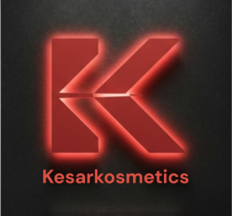

<div align="center">



# 🌸 Kesar Kosmetics

### *The Red Gold of Kashmir — Delivered to Your Door*

[](https://kesarkosmetics.vercel.app)
[](https://github.com/venkat-karthik/kesarkosmetics)
[](https://vercel.com)
[](https://firebase.google.com)

---

*Premium Kashmiri saffron skincare & wellness — hand-harvested at 2,200m altitude in Pampore, Kashmir.*

</div>

---

## ✨ About the Project

**Kesar Kosmetics** is a full-featured e-commerce web application for authentic Kashmiri saffron-based skincare and wellness products. Built with a modern static frontend powered by Firebase, the site delivers a premium shopping experience — from browsing products to Razorpay-powered checkout.

> 🏔️ Every product begins with saffron hand-harvested at dawn in the Karewa fields of Pampore, J&K — the saffron capital of India.

---

## 🚀 Tech Stack

| Layer | Technology |
|---|---|
| **Frontend** | Vanilla HTML5 · CSS3 · JavaScript (ES Modules) |
| **Styling** | Tailwind CSS (CDN) · Custom CSS |
| **Database** | Firebase Firestore |
| **Auth** | Firebase Authentication (Google OAuth) |
| **Payments** | Razorpay Payment Gateway |
| **Hosting** | Vercel (Static) |
| **Analytics** | Google Analytics 4 |

---

## 🛍️ Features

### 🛒 Shopping Experience
- **Product catalog** with category filters and real-time price updates (polls Firestore every 30s)
- **Product detail pages** with image gallery, YouTube video embed, size/variant selection
- **Hover slideshow** on product cards — images cycle automatically on mouse-over
- **Smart search overlay** — instant results as you type

### 💳 Cart & Checkout
- **Firebase-synced cart** — persists across devices when logged in
- **Cart drawer** with free-shipping celebration animation 🎉
- **Full checkout flow** — address, payment method (Razorpay / COD), order confirmation
- **GST labels** auto-applied per product category

### 👤 User Account
- **Google Sign-In** — one-click authentication
- **Wishlist** — saved across sessions
- **Order tracking** — live status updates
- **Review system** — verified-purchase reviews with star ratings

### 🔐 Admin Panel
- Protected dashboard at `/admin/`
- Manage products, orders, users, blogs, subscribers, revenue
- Real-time Firestore sync

---

## 📁 Project Structure

```
kesarkosmetics/
├── index.html              # Homepage — hero carousel, products, reviews
├── products.html           # Product listing with category filters
├── product.html            # Product detail — gallery, variants, reviews
├── cart.html               # Cart page
├── checkout.html           # Checkout — address, payment, confirmation
├── login.html              # Firebase Google Sign-In
├── wishlist.html           # Saved products
├── about.html              # Brand story — Kashmir saffron heritage
├── blogs.html              # Wellness & saffron blogs
├── faq.html                # Frequently asked questions
├── contact.html            # Contact form + office info
├── track-order.html        # Order tracking
│
├── css/
│   └── style.css           # Main stylesheet (~35KB)
│
├── js/
│   ├── firebase-config.js  # Firebase init, auth helpers
│   ├── products.js         # Firestore product queries
│   ├── cart.js             # Cart logic (localStorage + Firestore sync)
│   └── wishlist.js         # Wishlist management
│
├── admin/                  # Admin dashboard (Firebase-auth protected)
│   ├── dashboard.php
│   ├── products.php
│   ├── orders.php
│   └── ...
│
├── assets/                 # Images & favicon
├── vercel.json             # Vercel deployment config
└── convert_php_to_html.py  # Tool used to convert PHP → static HTML
```

---

## 🌿 Branches

| Branch | Description |
|---|---|
| `main` | ✅ **Production** — Static HTML/JS/CSS, deployed on Vercel |
| `php-version` | 📦 **Legacy** — Original PHP site (requires Apache/Nginx + PHP) |

---

## ⚡ Getting Started

### Run Locally

Since this is a **static site**, no build step needed:

```bash
# Clone the repo
git clone https://github.com/venkat-karthik/kesarkosmetics.git
cd kesarkosmetics

# Serve with any static server
npx serve .
# or
python3 -m http.server 3000
```

Then open `http://localhost:3000`

### Deploy to Vercel

```bash
npm i -g vercel
vercel --prod
```

Or connect your GitHub repo to [vercel.com](https://vercel.com) for automatic deployments on every push.

---

## 🎨 Design Highlights

- **Dark saffron palette** — `#3E2723` brown · `#F5A800` gold · `#E8620A` orange
- **Playfair Display** headings + **Inter** body text
- **Glassmorphism** cards with subtle shadows and warm borders
- **Micro-animations** — hero carousel, falling saffron particles, product hover slides
- **Fully responsive** — mobile-first, tested across 4 breakpoints

---

## 📦 Key Pages

| Page | URL |
|---|---|
| Home | `/` |
| Products | `/products.html` |
| Product Detail | `/product.html?id=<id>` |
| Cart | `/cart.html` |
| Checkout | `/checkout.html` |
| Track Order | `/track-order.html` |
| About | `/about.html` |
| Blogs | `/blogs.html` |
| FAQ | `/faq.html` |
| Contact | `/contact.html` |

---

## 📞 Contact

**Kesar Kosmetics**  
📍 Befina Pampore, Near Govt Middle School, Pampore – 192121, J&K, India  
📧 [kesarkosmetics@gmail.com](mailto:kesarkosmetics@gmail.com)  
📞 +91 98415 24064  

**Branch Office — Chennai**  
📍 19, Valliammal Road, Vepery, Chennai – 600007, Tamil Nadu, India

---

## 🏗️ Built & Designed by

<div align="center">

**[Velfound](https://velfound.com)**  
*Crafting digital experiences that feel as premium as the products they represent.*

---

<sub>© 2025 Kesar Kosmetics · All rights reserved · Made with ❤️ for a sustainable future</sub>

</div>
